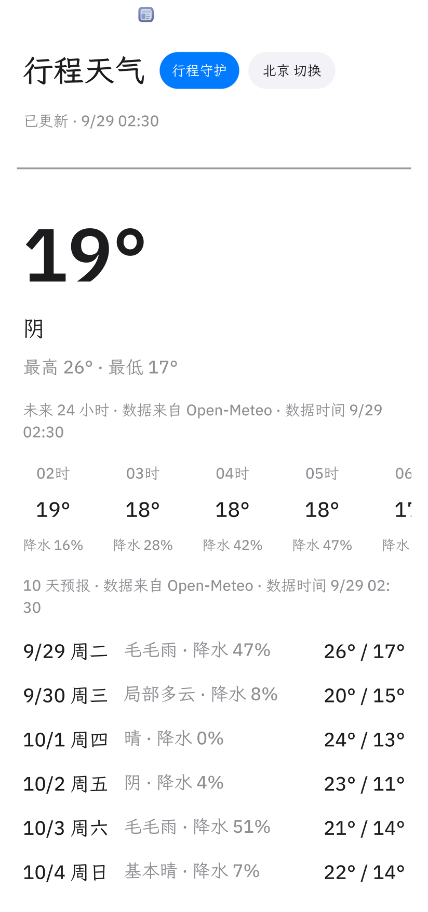
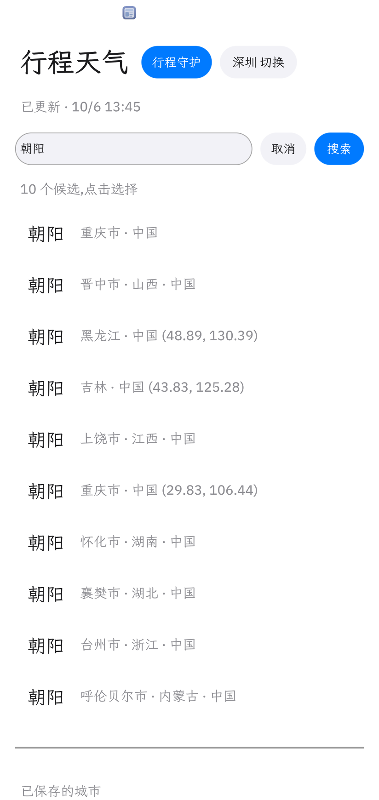

# 行程天气(trip-guardian)

看天气,守护每一次出行。一个 [Octoscript](https://github.com/OctoSense-org/OctoScript-App-Design-Flow) 脚本应用:同一个包可以装进 OctoSense 的 Card runner(经 App Hub 安装),也可以导入 Rinx 小程序宿主运行。

- 应用 id:`trip-guardian`,版本 `0.1.1`
- 许可证:Apache-2.0(见 `LICENSE`)
- 源码:`bundle/`(`manifest.json`、`listing.json`、`main.splash`、`assets/`、`screenshots/`)

## 它做什么

1. **天气首页**:当前城市的气温和天况、未来 24 小时逐小时预报、10 天预报(日期带星期),每块都标注「数据来自 Open-Meteo · 数据时间」。
2. **城市面板**:预置 8 个城市,可以搜索添加。同名地点(例如「朝阳」)会列出候选并附上区县,由你选择;搜不到时明确提示;「取消」可以不改城市直接退出。
3. **行程守护**:用一句话描述计划,例如「周六上午九点去深圳湾骑车,大概两小时」,分四步完成:
   1. **解析**:得出地点、日期(带星期)、开始时间、时长,四项都能改;缺什么就在解析卡上标红,并用白话提示。
   2. **风险**:先定位地点,再取计划时段的逐小时预报,列出降水概率、降水量、体感温度、风速、紫外线五项在窗口内的最差值(带小时),给出低、中、高风险。
   3. **方案与执行**:给出改期、改为室内、携带物品、保持原计划四类方案;单击选择后「确认执行」,写入行程簿并记一条执行台账。同一方案再次确认会显示「已执行,未重复」。
   4. **行程簿**:核验时按计划的地点和日期重新取数(不用缓存)再比对,结果附上新的数据时间(改期要求新时段不是高风险;其他方案核验读回一致,风险仍高时另行提醒);可以删除,3 秒内可撤销;重启后城市、行程簿、台账都还在。

## Agent 的角色

原则:**模型只写理解和方案,不写事实;执行和核验不经过模型。**

| 环节 | 有 agent 时 | 没有 agent 时 |
|---|---|---|
| 解析一句话 | `octos.turn.start` 让 agent 只回 JSON:`{place, date, start, duration_min, missing[]}` | 本地规则解析(今天/明天/后天/周X/下周X/M月D日/M/D、N点半、一个半小时、今晚/明早等) |
| 出方案 | agent 只回 `{options:[{action, why, checklist[]}]}`,最多 3 项 | 按风险等级用规则给出 |
| 执行、核验 | 始终由代码完成 | 同左 |

**agent 回复的校验**(不通过的逐项丢弃,全部不通过就自动改用规则方案):
- 必须是合规 JSON,只允许规定字段,字段类型正确;
- `why` 里出现的每个数字都要能在取到的事实里找到(±0.5 或 ±1%;时间、日期、「N 天内」等写法按允许集合核对),否则判为编造;
- `action` 只能是 reschedule / mark_indoor / add_checklist / keep 四种,`checklist` 只能来自固定词表(雨具、补水、保暖衣物、防晒),不得含 URL;
- 方案按钮上的文字由代码生成,不使用 agent 原文;改期的目标日由代码在 5 天内找非高风险日,找不到时丢弃 agent 的改期项;
- 原句没说具体几点、agent 自己填了时间时,界面会标注「时间按 HH:MM 估计」。

**等待与失败**:单次请求最多等 90 秒;等待期间先显示规则结果并提示「助手繁忙,正在重试…」,agent 结果到了再替换并标注来源。宿主上没有 octos 服务时直接走规则,界面写明来源。在 OctoSense 上第一次使用会弹出系统的同意窗口,应用会提示「在弹窗里点 Allow 后,再点一次解析」;拒绝之后方案一直由规则给出。每次 agent 调用和校验结果都记进台账(kind=agent,只记结论和原因,不记回复全文)。

## 权限、数据与隐私

| 权限 | 用途 |
|---|---|
| `net`:`api.open-meteo.com`、`geocoding-api.open-meteo.com` | 取预报、搜索城市和地点 |
| `storage` | 城市列表 `cities.json`、行程簿 `plans.json`、执行台账 `ledger.json`(只在本设备) |
| `octos.session.open`、`octos.turn.start` | 行程守护的解析和方案(可选,不可用时回退到规则) |

- 数据来源:预报与地理编码来自 [Open-Meteo](https://open-meteo.com/)(`timezone=auto`,日期和星期按当地时间计算),覆盖范围和准确性以其为准;预报只有 16 天,超出时提示「还没有可靠预报」。
- 不申请定位、相机、通讯录、`matrix.*`、`model` 等权限;不收集、不上传个人数据。发给 agent 的只有你输入的那句话和取到的天气数字。
- 两个宿主的数据各自独立(宿主给每个应用的存储目录不同)。

## 运行与复现

需要的宿主和工具(本作品测试时的版本):

| 宿主 | 版本 | 说明 |
|---|---|---|
| App Hub `card-host` | [OctoSense-App-Hub](https://github.com/OctoSense-org/OctoSense-App-Hub)(含 `hub` CLI) | 最快,没有 octos 服务,走规则 |
| OctoSense 桌面 | [OctoSense](https://github.com/OctoSense-org/OctoSense) main `7b03d2f`(含 #106 Card runner octos 服务)+ octos 内核 `0e6db72d` | 经本地 App Hub 目录安装,有 agent |
| Rinx 小程序 | [Rinx](https://github.com/hagency-org/Rinx) `68afcf79` 加关闭重开闪退修复 `cf9a1fb9`(在 OctoSense 里以 `--module rinx` 运行) | 本地导入未签名包,有 agent |

测试平台:macOS(14.6 和 27.0)。

**1. card-host(推荐先试)**

```sh
# 在 OctoScript-App-Design-Flow 里
tools/octo check /path/to/weather-app/bundle      # hub stamp + check,应为 PASSED
tools/octo run   /path/to/weather-app/bundle      # 打开窗口
```

**2. OctoSense 桌面(有 agent)**

- octos 内核按 OctoSense 文档编译:`cargo build --release -p octos-cli --bin octos --no-default-features --features api,git,ast`。
- 用 `hub keygen / certify / sign-manifest / publish` 把 `bundle/` 发布到一个本地目录,再以 `OCTOSENSE_HUB=<目录> OCTOSENSE_HUB_ANCHOR=<anchor>` 启动桌面(步骤见 App Design Flow 的 `docs/PUBLISHING.md` §4)。不要设置 `OCTOS_APP_CORE_DIR`:OctoSense 使用自己的 `$OCTOSENSE_HOME/octos-home/.octos`。
- 在 AI providers 里配置模型;Dock 里打开 App Hub → 行程天气 → Get → Install → Open;第一次解析时在同意窗口点 Allow。

**3. Rinx 小程序**

`bundle/` 是给 App Hub 的**已签名**版本;Rinx 的本地导入只接受未签名包(会提示 "no signature verifier is installed")。先生成一份未签名副本(代码和素材完全相同,只去掉签名、重新计算摘要):

```sh
tools/rinx-copy.sh          # 生成 ./rinx-bundle,需要 PATH 里有 hub
```

然后在 Rinx 侧栏「Mini apps」→「导入应用」→ 路径填 `rinx-bundle` 的绝对路径 → Review bundle → Run。Rinx 给小程序的高度约 450px,守护页按四步拆分,每步都放得下。

## 验证记录

- `hub check --allow-unsigned`:PASSED(用 2026-10-04 的 App Hub `f801b58` 复核过)。
- 用 makepad remote 驱动的全量回归,在 OctoSense main + 真 agent 上 24/24 通过,脚本错误 0:首页、城市面板(搜索、候选、切换)、首次同意、5 句解析、缺项、超出预报范围、风险卡、方案逐项校验、确认、幂等、核验、行程簿删除与撤销、台账。
- 三个宿主都走通过完整流程:card-host、OctoSense 和 Rinx(用 `tools/rinx-copy.sh` 生成的未签名副本,12/12 通过)都是提交版本 `c335426`。在 CPU 负载和 Z.AI 限流(HTTP 429)下验证过不会卡住。

## 截图

| 首页 | 同名地点候选 | 解析卡 | 核验通过 | 缺项提示(失败状态) |
|---|---|---|---|---|
|  |  |  |  |  |

## 已知限制

- 模型服务商限流时,agent 那一步可能要 40 秒以上;期间先显示规则结果。
- 两个宿主之间不同步数据。
- 四步页签里,当前选中的那一步标签显示得很淡(Makepad 按钮在这个版本里的渲染问题,不影响操作)。
- 已用发布者密钥签名,App Hub 公共目录的收录以审核结果为准。

## 作者与支持

ZhangHanDong · 问题与建议请在本仓库提 [Issue](https://github.com/ZhangHanDong/weather-app/issues)。隐私说明见 [PRIVACY.md](PRIVACY.md)。
